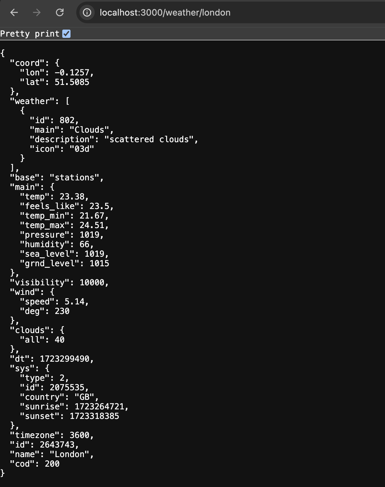

# Weather API
This Node.js API allows you to fetch weather data for a specific city and store it in either AWS DynamoDB or Azure Cosmos DB, depending on the cloud provider specified in the environment variables.

## Prerequisites
- Node.js and npm installed on your system.
- AWS CLI installed and configured with appropriate credentials (for the cloud deployment).
- Azure CLI installed and configured with appropriate credentials (for the cloud deployment).
- An AWS account with DynamoDB access (for the cloud deployment).
- An Azure account with Cosmos DB access (for the cloud deployment).
- An API key from [OpenWeatherMap](https://openweathermap.org/api) (a API service).

## Setup Instructions
- Clone the repository:
    ``` bash
    git clone https://github.com/AdoraNwodo/multicloud-course.git
    ```

- Install the dependencies:
    ``` bash
    npm install
    ```

- Set up the environment variables (local setup):
    Create an `.env` file in the root of the project with the following variables:
    ``` bash
    # General configuration
    PORT=3000
    
    # Weather API Configuration
    WEATHER_API_KEY=your_openweathermap_api_key

    ```
    To setup your env variables on the cloud, it happens through IaC.

## Running the API
- Compile the TypeScript code:
    ``` bash
    npx tsc
    ```

- Start the server:
    ``` bash
    node dist/server.js
    ```

The server will start on the port specified in the `.env` file, or default to port 3000.

## Testing the API
You can test the API using a tool like curl, Postman or your browser.
Example: 
``` bash
curl http://localhost:3000/weather/{city}
```

Replace `{city}` with the name of the city you want to get the weather for. The API will fetch fresh data from the weather API and respond with the current weather details for the specified city.


